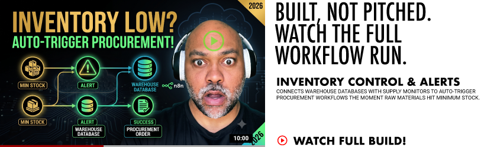

  

# Inventory Control & Alerts
### Supply Chain, Logistics & Construction  
Connects warehouse databases with supply monitors to auto-trigger procurement workflows the moment raw materials hit minimum stock.  
[See Full Build](https://adbyrdllc.wixstudio.com/iautomateshit/demos) 